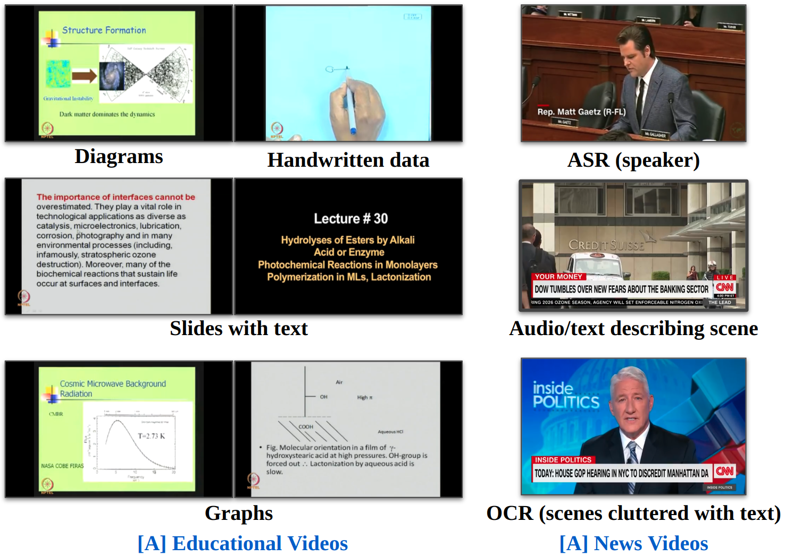

# Prompt2LVideos: Exploring Prompts for Understanding Long-Form Multimodal Videos

Welcome to the Prompt2LVideos repository! This repository is designed to enhance the understanding and retrieval of long-form videos in educational and news domains by leveraging advanced techniques in Optical Character Recognition (OCR) and Automatic Speech Recognition (ASR). This repository provides the link to the dataset and code necessary to extract meaningful insights from videos using existing methods.

## Table of Contents

- [Introduction](#introduction)
- [Dataset](#dataset)
- [Getting Started](#getting-started)
- [Disclaimer](#disclaimer)

## Introduction

Understanding lengthy videos, especially in educational and news contexts, is critical due to their societal influence. Traditional video-text fusion methods face challenges with long-form videos, which can span from minutes to hours, necessitating more annotators with subject expertise. This project explores the use of OCR and ASR to automatically generate textual content from videos, combined with LLMs like ChatGPT to derive insightful prompts. This approach aims to facilitate comprehensive video comprehension and retrieval.

### Key Features

- **Multimodal Cues:** Utilizes both OCR tokens and ASR transcripts to extract comprehensive content from videos.
- **Large Language Models:** Leverages LLMs to enhance understanding and generate high-quality video-text data.
- **Edu-News Dataset:** A curated dataset comprising long-form lectures and news videos specifically designed for this study.
- **Prompt Engineering:** Explores prompt engineering techniques to improve the comprehension of long-form multimodal video datasets.

## Dataset

- **Link to the videos**: We use videos from two categories: News and Educational videos.
- **Precomputed OCR tokens**: Efficient indexing methods to speed up video retrieval tasks.
- **Precomputed transcripts**: Simple and intuitive API for easy integration into your applications or research projects.

[Dataset Link](https://drive.google.com/file/d/1fXZKAJEW2CT0ufkK6v-t5QDLX42BCjV8/view?usp=sharing)

## Getting Started

To get started with long-range video understanding and retrieval, follow these steps:

1. **Clone the Repository:** Clone this repository to your local machine using `https://github.com/soumyasj/VideoRetrievalIDP.git`.

2. **Install Dependencies:** Install the required dependencies by running `pip install -r requirements.txt`.

3. **Get OCR tokens:** Obtain OCR tokens of the frames of videos by running `/utils/python get_ocrs.py`.

4. **Get Transcripts:** Obtain transcripts of the videos by running `/utils/python get_transcripts.py`.

5. **Compute TF-IDF matrices:** Obtain matrices that are needed to perform TF-IDF-based retrieval by running `python make_if_idf_ret.py`.

6. **Evaluation:** Evaluate the retrieval by TF-IDF matrices by running `python evaluate.py`.

## Disclaimer

All videos are sourced from YouTube CNN news videos and NPTEL for educational videos and belong to their respective creators. We don't intend any copyright infringement. Downloading the videos is only for the purpose of education and not for anything else. This page was built using the Academic Project Page Template, which was adopted from the Nerfies project page.
