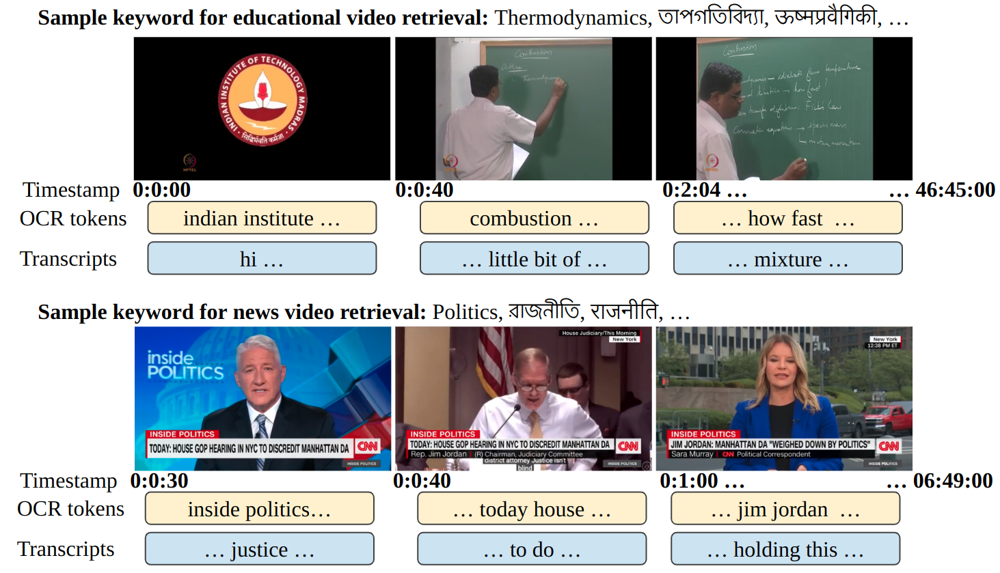

# Prompt2LVideos: Exploring Prompts for Understanding Long-Form Multimodal Videos

Welcome to the Long-range Video Retrieval repository! In this repository we provide the code to extract OCR tokens from frames of videos using easyocr, code to obtain transcripts of videos using opensourced speech-to-text module from pytorch called silero, and code to compute TF-IDF-based Video Retrieval system to retrieve videos based on OCR tokens and transcripts.

## Table of Contents

- [Introduction](#introduction)
- [Dataset](#dataset)
- [Getting Started](#getting-started)

## Introduction

In today's digital media landscape, understanding the importance of lengthy videos, especially in education and news, is crucial due to their significant societal influence. This study explores the use of multimodal cues such as OCR tokens and transcripts for tasks like video retrieval in long videos. Additionally, it investigates how large language models like ChatGPT and Bard can enhance insights through various prompting strategies, shedding light on the potential of prompts with unlabelled data in understanding lengthy videos.

## Dataset

- **Link to the videos** We choose videos from two video categories: News videos and Educational videos.

- **Precomputed OCR tokens** Our toolkit includes efficient indexing methods to speed up video retrieval tasks, ensuring low latency and high scalability.

- **Precomputed transcripts** A simple and intuitive API makes it easy to integrate video retrieval functionality into your applications or research projects.

[Dataset Link](https://drive.google.com/file/d/1fXZKAJEW2CT0ufkK6v-t5QDLX42BCjV8/view?usp=sharing)

## Getting Started

To get started with long-range video understanding and retrieval, follow these steps:

1. **Clone the Repository:** Clone this repository to your local machine using `https://github.com/soumyasj/VideoRetrievalIDP.git`.

2. **Install Dependencies:** Install the required dependencies by running `pip install -r requirements.txt`.

3. **Get OCR tokens:** Obtain OCR tokens of the frames of videos by running `/utils/python get_ocrs.py`.

4. **Get Transcripts:** Obtain transcripts of the videos by running `/utils/python get_transcripts.py`.

5. **Compute TF-IDF matrices:** Obtain matrices that are needed to perform TF-IDF-based retrieval by running `python make_if_idf_ret.py`.

6. **Evaluation:** Evaluate the retrieval by TF-IDF-matrices by running `python evaluate.py`.
